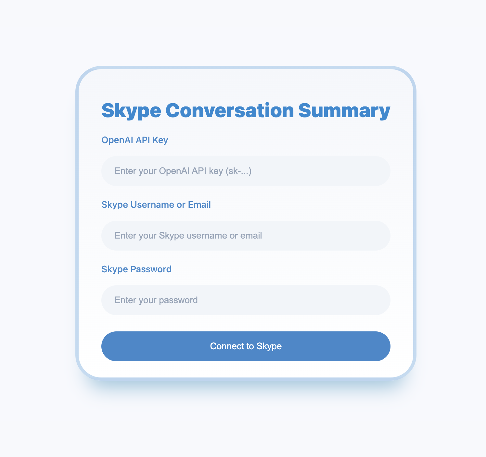
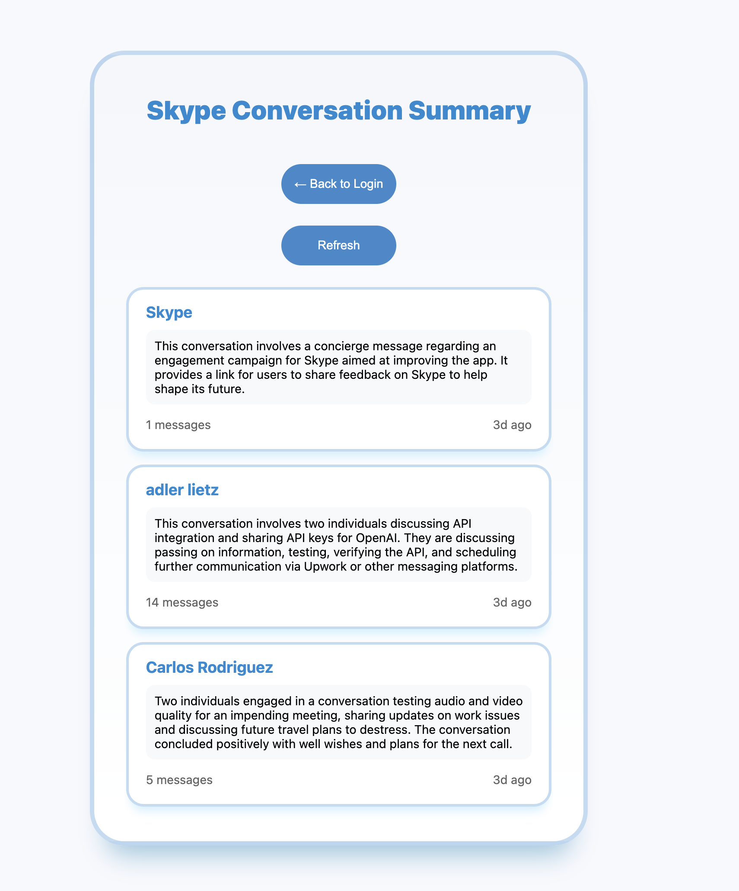

# Skype Conversation Summarizer

A web application that connects to Skype and uses OpenAI's GPT-3.5 to generate concise summaries of your recent Skype conversations.

## Overview

This web application allows users to automatically generate summaries of their recent Skype conversations using artificial intelligence. The app fetches Skype conversations from the past 5 days and uses OpenAI's GPT-3.5 model to create clear, concise summaries of each conversation.

## Features

- Secure Skype authentication and message retrieval
- Automatic summarization of conversations using AI
- Summaries of conversations from the past 5 days
- Real-time refresh functionality
- Message count and timestamp for each conversation
- Clean, responsive user interface

## Technology Stack

### Frontend
- HTML5
- CSS3 (Custom styling with responsive design)
- JavaScript (Vanilla JS for DOM manipulation and API interactions)

### Backend
- Python
- Flask (Web framework)
- Flask-CORS (Cross-Origin Resource Sharing)
- Gunicorn (Production server)

### APIs
- SkPy (Python library for Skype API integration)
 - Used for authentication and retrieving conversation history
 - Handles real-time message fetching and user data
- OpenAI GPT-3.5
 - Processes conversation content
 - Generates concise, contextual summaries
 - Handles natural language processing

## How It Works

1. Users provide their:
  - OpenAI API key
  - Skype username/email
  - Skype password

2. The application:
  - Authenticates with Skype
  - Retrieves recent conversations
  - Processes each conversation through GPT-3.5
  - Displays summarized results

3. Users can:
  - View summaries of all recent conversations
  - See message counts and timestamps
  - Refresh to get latest conversations
  - Return to login as needed

## Deployment

The application is deployed on Heroku and can be accessed at:
https://skype-summarizer-b5cd2e2f111d.herokuapp.com/

## Requirements

To use the application, users need:
- A valid Skype account
- An OpenAI API key
- A modern web browser

## Security Notes

- The application does not store any user credentials
- All data is processed in real-time
- Connections are secured using HTTPS
- Session data is temporary and client-side only

## Development

Built with security and user experience in mind, featuring:
- Rate limiting protection
- Error handling
- Session management
- Responsive design
- Cross-platform compatibility
